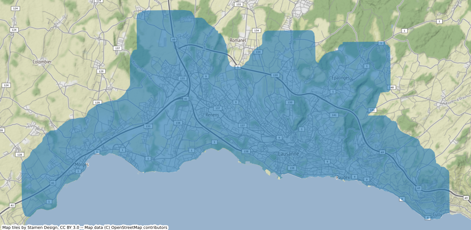

# Lausanne agglomeration extent

Obtention of the spatial extent of the agglomeration of Lausanne with the [Urban footprinter](https://github.com/martibosch/urban-footprinter), which implements the methods proposed in the [Atlas of Urban Expansion](http://atlasofurbanexpansion.org/). More precisely, in this repository, a pixel is considered part of the urban extent when at least 15\% of the pixels that surround it (with a 500m radius) are of urban land use.

## Note about the reproducibility of this computational workflow

The obtained extent is based on the [Official cadastral survey of the canton of Vaud](www.asitvd.ch/md/508) whose exclusive owner is the canton of Vaud. I do not have the rights to redistribute the cadastre shapefile needed to obtain the spatial extent (the shapefiles used in this workflow are hosted in a private S3 instance).

## Acknowledgments

* **Source**: Géodonnées Etat de Vaud 
* With the support of the École Polytechnique Fédérale de Lausanne (EPFL)
* Project based on the [cookiecutter data science project template](https://drivendata.github.io/cookiecutter-data-science). #cookiecutterdatascience
